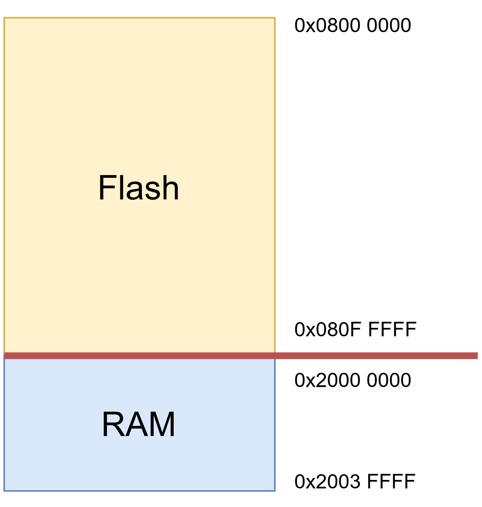

# Bera-Metal Book

不以任何開發版、單晶片為例純粹講述觀念與各語法知識。

須注意不同的編譯器有不同的語法與設定需要注意。
像是 Keil 不是使用 Makefile 與 Linker Script 而是其他設定檔。本系列會以 Ecipse 為主要編譯器。

### 章節
#### Chapter 1 Bare-Matel 概述
#### Chapter 2 系統論述
#### Chapter 3 專案設計與構思
#### Chapter 4 初步設計
#### Chapter 5 周邊設計

</br>

---

</br>

# Bare-Matel 概述

甚麼是 Bare-Matel（俗稱裸機），也就是在沒有任何資源的情況下進行晶片的開發（這裡的晶片不限於 MCU SoC 等）。拿 STM32 開發來舉例，我們可以使用 STM32CubeMX 利用 UI 介面對想要的功能直接點選後生成 Project，整份專案就會直接出現，這就是最簡單的例子，在生成好的專案中我們只需要撰寫 main 即可，其實在很多廠商提供的 Example 中我們都可以直接這樣做，因為他們已經幫我們做好了很多前置工作，像是：

1. 周邊的設計（Drivers I/O）
2. C code 與硬體之間的溝通、控制
3. 記憶體的連結
4. 專案的編譯規則
5. 最重要的 Toolchain

</br>

接下來，請在有基本韌體知識的情況下再開始學習！

</br>

### 第一步，知道程式放在哪裡

我們都知道要讓晶片可以動起來，最基本的就是要把我們寫好精美的程式燒錄進晶片中。

程式會被燒錄進 Flash 記憶體中。當 MCU 開機（如 POR）時，處理器從 Flash 開始抓取指令執行。某些特定資料（如 .data 區段）會從 Flash 搬到 RAM，而大部分的程式碼（.text 區段）是直接在 Flash 執行的。

```
那我們燒錄的是甚麼，最常聽到的其實就是 Program Image 也就是在我們編譯好整份專案之後所產出來的檔案，檔案很可能是 .elf .bin 或是 .hex 都有可能，那編譯的部分是 Makefile 的工作並不是這裡要贅述的部分。
```

</br>

假設在產品的 Datasheet，我們可以看到有關於 Flash、SRAM 的位置：



其中，RAM 有 256KB，Flash 有 1MB，在這張圖中我們可以直接知道以下兩點：</br>
1. 主程式儲存區域有 1MB 的大小
2. 其餘資料的空間有 256KB

</br>

那簡單來說，我們第一個工作就是要把程式燒錄到 Flash 中，那我們該如何指定記憶體位置。

Linker 是最主要幫助我們的，這時我們就需要 Linker Script 與組合語言。
（後續會有章節專門介紹）

</br>

