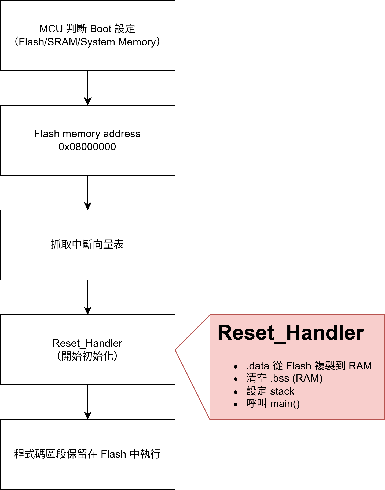

# Bera-Metal Book

以手邊現有的開發板作探討，不同的編譯器有不同的語法與設定需要注意。
像是 Keil 不是使用 Makefile 與 Linker Script 而是其他設定檔。

### 章節
#### 1. Linker Scrpit
#### 2. Makefile
#### 3. 整合測試
#### 4. Assembly（Startup.s）
#### 5. main.c / Driver / CPU initialization
#### 6. 專案架構
#### 7. 整合測試

</br>

在章節之間的整合測試為先測試先前撰寫的檔案，其中會穿插開發版手冊資訊（以STM32F412 為例）。

請在有基本韌體知識的情況下再開始學習！

example 中的程式可以直接透過 windows CMD 執行。

</br>

# Linker Script

Linker Script（連結器腳本）是一種指令文件，用來告訴「連結器（linker）」如何將各個編譯出來的目標檔（.o）排列、放進記憶體中。

Linker 的作用就是把輸入檔（object file）的 section 整理到輸出檔的  section。除此之外也會定下每個 object file 中尚未確定的符號位址，所以如果有 object file 用到不存在的 symbol，就會出現常看到的 <font color=red>undefined reference error</font>。

而 linker script 就是提供給 linker 參考的文件，它告訴 linker 我想要怎麼擺放這些 section，甚至也可以定義程式的起始點在哪邊。

在嵌入式開發中，沒有作業系統幫你載入與排程程式，你必須自己告訴系統「程式從哪裡執行、資料放在哪裡」，這正是 linker script 的功能。

</br>

### 第一步，知道程式放在哪裡

程式會被燒錄進 Flash 記憶體中。當 MCU 開機（如 POR）時，處理器從 Flash 開始抓取指令執行。某些特定資料（如 .data 區段）會從 Flash 搬到 RAM，而大部分的程式碼（.text 區段）是直接在 Flash 執行的。

```
那我們燒錄的是甚麼，最常聽到的其實就是 Program Image 也就是在我們編譯好整份專案之後所產出來的檔案，檔案很可能是 .elf .bin 或是 .hex 都有可能，那編譯的部分是 Makefile 的工作並不是這裡要贅述的部分。
```

</br>

在產品的 Datasheet 中我們可以看到有關於 Flash、SRAM 的位置：


</br>

其中，SRAM 有 256KB，Flash 有 1MB，在這張圖中我們可以直接知道以下兩點：</br>
##### 1. 主程式儲存區域有 1MB 的大小
##### 2. 其餘資料的空間有 256KB

</br>

那接下來的工作就可以開始撰寫我的程式與資料區段（Section）該如何配置。

</br>

## 開機流程

根據提供的 Datasheet 說明，該開發版有三種開機模式：Flash、System Memory、SRAM，透過更改 Boot Pin 改變開機設定選項，預設為 Flash 所以無需更動。

在開機流程說明如下：



</br>

首先，MCU 開機（或 POR）會判斷開機模式，由 Flash memory 開始讀取，並抓取中斷向量表，之後藉由 Reset_Handler 的 Entry point 開始進行初始化與跳入 main ，其中主程式會一直保留在 Flash 中執行。那中斷向量的記憶體位置由這裡做宣告，但註冊則是在 Assembly 中；初始化部分也會是在 Assembly 完成。

</br>

經由這些說明可以清楚知道我們的 Linker Script 應該要做的事：</br>
##### 1. 將需要運行的主程式區塊宣告好
##### 2. 將 RAM 宣告好
##### 3. 設定向量表區塊
##### 4. 設定資料區塊
##### 5. 決定資料的儲存位置

</br>

## 五個關鍵部分

* memory：定義 embedded 可以使用的記憶體區域，需指定起始位置、大小和存取權。
  * 每個區塊都需要有一個名稱，例如：Flash、RAM。
  * 存取權限：ｒ讀取、ｗ寫入、ｘ執行。

* sections：memory 中定義的記憶體區域內不同部分的位置。
  * 例：.text 程式、.data 初始化資料、.bss  未初始化資料。

* entry：設定程式執行的入口點。

* symbols：在連結器檔案中定義自訂符號。這些符號可用於各種目的，例如：定義特定部分或記憶體區域的起始和結束位址，或作為程式碼中的常數。

</br>

## 設計步驟

1. 定義記憶體區域（memory）
2. 指定 sections
3. 設定程式入口點
4. 定義符號

</br>

一個設計好的 Linker Script 會像這樣：


定義好的 Memory 位置、程式的 Entry Point、分好的 sections。

</br>

對於一個複雜的項目，高級功能對於微調記憶體分配和組織至關重要！</br>
* PHDRS 指令等功能有助於定義 ELF 檔案的程式頭。
* VERSION 指令則管理符號版本控制。
* MEMORY 指令對於指定記憶體區塊的大小和位置至關重要。
* SECTIONS 指令則詳細說明如何將輸入部分對應到輸出部分。

</br>

## 語法

接下來開始介紹一些常看到的語法

### NOLOAD

表示在程式啟動期間不應將特定部分載入記憶體。</br>

* Debug 期間使用

</br>

### AT 

用於定義某個 section 的載入位置，該位置可以與執行期間位置不同。</br>

* 例如將某個部分儲存在一個記憶體區域（例如，快閃記憶體）但在運作時將其載入到另一個記憶體區域（例如，RAM）時，這很有用。

</br>

### ALIAS

為現有符號建立別名。對於提供舊程式碼的相容性或為常用符號創建更具描述性的名稱很有用。

</br>

### ASSERT

用於在連結過程中如果不滿足指定的條件則產生錯誤。這有助於確保滿足某些約束，確保某個部分不會溢出其分配的記憶體區域。

</br>

### ALIGN 

表示以4096 bytes 的單位進行對齊，同時這也是 xv6 中定義在記憶體中，一個分頁的大小 (分頁為記憶體區塊的單位)。

</br>

