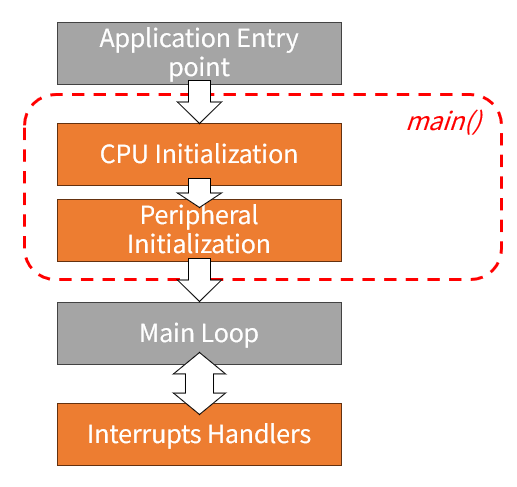

# ARM Cortex Architecture Bare-Metal Emmbedded System Research

嵌入式系統研究，本專案將會使用 STM32F103 與 STM32F412 進行裸機開發。 

目標：在沒有 ST 預設環境的情況下進行完整裸機韌體開發。 
作業環境：Windows 11 & STM32CubeIDE & VS code 

 

# Bare-Metal Emmbedded System 簡介與教學

#### What is Bare-Metal
Bare-Metal（中文常譯為「裸機」）是一種不依賴作業系統（如 Linux、RTOS）的開發方式，程式直接運行在硬體之上。 
這種方式常用於嵌入式系統的低階開發，特別是在資源受限或對實時性有高要求的場景中。
 

下圖為裸機流程圖，從圖中可以了解到，硬體開機後一直到 Main Function 的 Loop 發生了甚麼 ~  

 

#### What is Emmbedded
Embedded（嵌入式）是指嵌入某種系統或裝置中的計算機系統，它不是一台獨立的電腦，而是為了執行特定功能而存在的「專用計算單元」。
 

嵌入式系統（Embedded System）定義： 
一種以應用為導向的電子系統，內部包含微處理器/微控制器（如 ARM Cortex），可對外部輸入作出反應並進行控制。其硬體與軟體通常被設計為不可分割的一體。

#### 關於 ARM 架構
ARM 架構（Advanced RISC Machine），我們是指一系列基於 RISC（精簡指令集）的微處理器架構，被廣泛使用在嵌入式系統、智慧手機、IoT 裝置等領域。 

 

**ARM 架構總覽：**

基本特點：
| 特性 | 說明 |
|---|---|
| RISC 架構 | 指令精簡、效率高，每條指令執行時間一致 |
| 低功耗設計 | 適用於行動裝置與電池供電產品|
| 高整合度 SoC | 多數搭配內建記憶體控制器、DMA、外設等 |
| 多核心支援 | 尤其在 Cortex-A 系列中 |
| 廣泛支援度 | 廠商多（如 STM、NXP、TI）、開發工具齊全 |

ARM 架構的分類：
| 系列 | 主要用途 | 常見核心 | 描述 |
|---|---|---|---|
| Cortex-M | 微控制器 | M0, M0+, M3, M4, M7, M33, M55 | 低功耗、適合裸機或 RTOS 嵌入式開發 |
| Cortex-R | 即時控制 | R4, R5, R7 | 高即時性、用於汽車、醫療、硬碟等領域 |
| Cortex-A | 應用處理器 | A5, A7, A9, A53, A72 等 | 運行完整 Linux 系統，適合高效能場景 |

 

## 關於這份 Project 與教學：
在開始之前首先簡單介紹需要的知識（不用擔心這裡都會教）。 

 

專案編譯與建置中需要的知識：Makefile、Linker Script、Assembly Language  
下圖為三者之間的關係：開發 Bare-Metal，需要 Assembly 啟動檔(startup.s)、連結腳本(Linker Scripts)、系統相關環境初始化(system.c)、主程式區塊(main.c)、相關 I/O 函式庫(Drivers.c)與編譯時的規則 (Makefile)。 

## 參考資料
[RISC-V vs. Arm：通用MCU和邊緣AI晶片應如何選擇？](https://www.eettaiwan.com/20220620nt31-risc-v-vs-arm/) 
