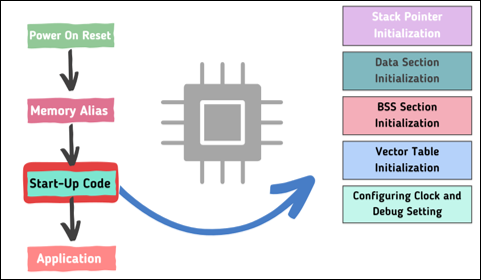
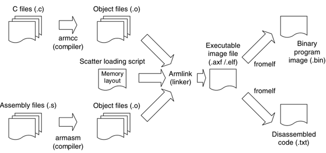

# ARM Cortex Architecture Bare-Metal Emmbedded System Research

嵌入式系統研究，本專案將會使用 STM32F103 與 STM32F412 進行裸機開發。 

目標：在沒有 ST 預設環境的情況下進行完整裸機韌體開發。 
作業環境：Windows 11 & STM32CubeIDE & VS code 

 

# Bare-Metal Emmbedded System 簡介與教學

#### What is Bare-Metal
Bare-Metal（中文常譯為「裸機」）是一種不依賴作業系統（如 Linux、RTOS）的開發方式，程式直接運行在硬體之上。 
這種方式常用於嵌入式系統的低階開發，特別是在資源受限或對實時性有高要求的場景中。
 

下圖為裸機流程圖，從圖中可以了解到，硬體開機後一直到 Main Function 的 Loop 發生了甚麼 ~  

 

#### What is Emmbedded
Embedded（嵌入式）是指嵌入某種系統或裝置中的計算機系統，它不是一台獨立的電腦，而是為了執行特定功能而存在的「專用計算單元」。
 

嵌入式系統（Embedded System）定義： 
一種以應用為導向的電子系統，內部包含微處理器/微控制器（如 ARM Cortex），可對外部輸入作出反應並進行控制。其硬體與軟體通常被設計為不可分割的一體。

#### 關於 ARM 架構
ARM 架構（Advanced RISC Machine），我們是指一系列基於 RISC（精簡指令集）的微處理器架構，被廣泛使用在嵌入式系統、智慧手機、IoT 裝置等領域。 

 

**ARM 架構總覽：**

基本特點：
| 特性 | 說明 |
|---|---|
| RISC 架構 | 指令精簡、效率高，每條指令執行時間一致 |
| 低功耗設計 | 適用於行動裝置與電池供電產品|
| 高整合度 SoC | 多數搭配內建記憶體控制器、DMA、外設等 |
| 多核心支援 | 尤其在 Cortex-A 系列中 |
| 廣泛支援度 | 廠商多（如 STM、NXP、TI）、開發工具齊全 |

 

ARM 架構的分類：
| 系列 | 主要用途 | 常見核心 | 描述 |
|---|---|---|---|
| Cortex-M | 微控制器 | M0, M0+, M3, M4, M7, M33, M55 | 低功耗、適合裸機或 RTOS 嵌入式開發 |
| Cortex-R | 即時控制 | R4, R5, R7 | 高即時性、用於汽車、醫療、硬碟等領域 |
| Cortex-A | 應用處理器 | A5, A7, A9, A53, A72 等 | 運行完整 Linux 系統，適合高效能場景 |

 

## 關於這份 Project 與教學：
在開始之前首先簡單介紹需要的知識（不用擔心這裡都會教）。 
關於全部的完整教學都分支在各相關的檔案中。 
 
這裡將會講述全部的觀念。
 

## 觀念
在最一開始大家入門**韌體**時想必都是使用 Keil 下載好出廠的 Example Code 直接更改 Main 燒錄就好！ 
現在可以想像自己需要在沒有出廠的 Example 情況下寫出一個可以使用的**開機程式**並且設計周邊可以使用的**Driver**！ 
聽起來好像很難，現在可以聽我娓娓道來！ 
 

### Makefile

在開始講解之前，先來了解一下編譯一個 Code 會需要甚麼，當我們輕鬆按下編譯按鈕時，其實會有一個叫做 Makefile 的東西在運作，Makefile 就是所謂的**規則**。 
那這份規則只在意所謂的相依性，也就是說今天我撰寫了一份 Driver.c 的程式那我一定需要一份相關的 Driver.h 或是其他的標頭檔，同時也會告訴編譯器那些檔案會有相關，並且進一步產生出我所需要的燒錄用程式，可能會是 .bin .elf 等等的。 
用一句話概括 Makefile：Makefile 就像是幫你設定整份專案檔案連結部分、需要編譯的檔案與需要產出哪些檔案的工具。 

在更白話說明：以前在 Keil 只要無腦按下 Build 就好，編譯器就會告訴你哪裡有錯誤，這是因為 Keil 本身就已經有包好規則；但是在 Bare-Metal 裡我們甚麼都沒有，所以需要自行撰寫好規則給編譯器，包含 Include path、Source file、Toolchain 還有最重要的 Rule

 

### Linker Scripts

Linker Script（連結腳本）是嵌入式系統開發中控制程式記憶體配置與段落擺放位置的關鍵檔案，在裸機開發（bare-metal）時尤其重要。 
 
Linker script 是給 linker（連結器）使用的設定檔，通常副檔名為 .ld，它告訴 linker：
* 哪些程式區段（如程式碼、資料、中斷向量表）應該被放到哪個實體記憶體地址
* 每個區段的對齊方式與大小限制
* 是否產生符號（symbol）供其他檔案使用

 

所以簡單來說 Linker Script 就是跟記憶體操作有關，我可以藉由 Linker Script 設定像是主程式碼要放是在哪個記憶位置中。

 

### Assembly

在裸機開發中，startup.s（也可稱為 startup.S 或 startup.asm）是一個用 Assembly（組合語言） 撰寫的啟動碼，負責從 MCU 開機後的第一條指令開始執行，在 C 的 main() 函式執行之前初始化系統。 
這是裸機開發不可或缺的一環，因為沒有作業系統幫你處理初始化、堆疊、記憶體搬移等事務。 

通常在一個專案中都可以找到 Startup.s 這樣一個檔案，它是由組合語言 Assembly 所撰寫的。 

Start-up code 是第一個在 MCU POR（Power on reset）後運行的程式，他可以引導 MCU 所需的關鍵部分初始化以及隨後目標 Application 的啟動。 
執行基本任務，使 MCU 準備好運行 Application 。 

簡單來說：Startup code 可以幫助我們切入 main 主程式，還有當 code 結束時該怎麼做，最重要的是要與 Linker Script 連結，進行各種初始化。

 

### C code

這裡的 C code 不單指 main function 包含像是 System Initialization 還有 Driver 的撰寫！

 

下圖為三者之間的關係：開發 Bare-Metal，需要 Assembly 啟動檔(startup.s)、連結腳本(Linker Scripts)、系統相關環境初始化(system.c)、主程式區塊(main.c)、相關 I/O 函式庫(Drivers.c)與編譯時的規則 (Makefile)。 

 

## 參考資料
[RISC-V vs. Arm：通用MCU和邊緣AI晶片應如何選擇？](https://www.eettaiwan.com/20220620nt31-risc-v-vs-arm/) 

