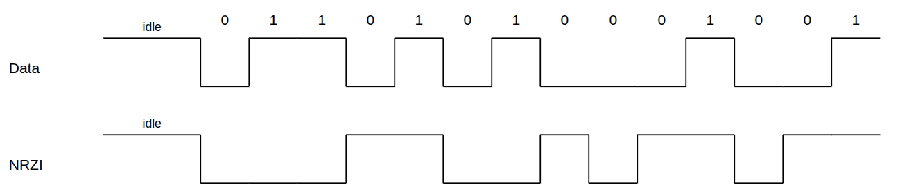

# USB

主要以介紹 USB 1.0 為主，每個不同版本的 USB 都有不同，但都可以向下相容。

### 簡介

USB（通用序列匯流排，Universal Serial Bus），是連接電腦與裝置的一種序列匯流排標準，也是一種輸入輸出（I/O）連接埠的技術規範，廣泛應用於個人電腦和行動裝置等資訊通訊產品，並擴展至攝影器材、數位電視（機上盒）、遊戲機等其它相關領域。

USB 分為主從（Host, Slave）兩大體系，一般而言， PC 中的 USB 系統就是作主，而一般的滑鼠、隨身碟則是典型的 USB 從系統。

USB 主控制器這一塊，我們至少要開發出 USB 的主控制器與從控制器，滑鼠是低速設備，所需的是最簡單的一類從控制器。主控制器則複雜得多，因為太過於複雜了，所以就形成了一些標準。在一個複雜的系統中，標準的好處就是可以讓開發者把精力集中在自己負責的一塊中來，只需要向外界提供最標準的介面，而免於陷於技術的汪洋大海中。

 

USB 主控制器主要有 1.1 時代的 OHCI 和 UHCI ， 2.0 時代的 EHCI ，這些標準規定了主控制器的功能和介面（寄存器的序列及功能）

所謂的 HCI 其實指的就是人機互動 Human-Computer Interaction ，說明一下這三個控制器類型：
* OCHI：
  * Open Host Controller Interface，開放主機控制接口
  * USB 1.1/1.0 的標準
  * 支援其他的一些介面，如支援 Apple 的火線
  * 硬體結構較為複雜，主要用於非x86的USB，如擴展卡、嵌入式開發板的USB主控
* UHCI：
  * Universal Host Controller Interface，通用主機控制接口
  * 是 Intel 主導的 USB 1.1/1.0 的標準，與 OHCI 不相容
  * 硬體較簡單，Intel 和 VIA 使用 UHCI，而其餘的硬體提供商使用OHCI
* EHCI：
  * Enhanced Host Controller Interface，增強式主機控制接口
  * USB 2.0 的標準

 

## 開發方向

假如今天只是要做一個簡單的 USB 設備，那其實只需要了解簡單的交握讓 Host 能夠辨識出來，之後開始傳送資料封包即可。

相對的今天若是要在 PC 上開發一個 USB 的接收應用程式則會有些許的不同，首先要針對現有的 USB 設備進行解包的動作，之後根據需求設計自己的應用程式，那開發方式也會有不同，Windows 與 linux 兩種作業系統從根本上就不太一樣，那要製作出相對應的應用程式就會不一樣。

既然都是學嵌入式開發的那想必一定都是寫 linux 的對吧！！！

這篇筆記以從設備為主，[linux 相關開發](../../../OS_Kernel_Develop/linux_kernel_function/Intserface-protocol/USB/Readme.md)則在別處。

 

# USB 主機、設備與集線器

在 USB 的主要硬體中可以分為三類：主機、設備與集線器，用生活中很常見的場景舉個例子，你有一台電腦你把滑鼠跟鍵盤插在主機上，這時你發現 USB 孔不夠了於是插上了一個 HUB 去擴增 USB 接口；以上其實就是最常見的幾種 USB 設備，電腦主機就是 USB host、滑鼠跟鍵盤這類設備就是 USB Slave、HUB 就是集線器，當然偶爾也會有例外像是有的設備可以同時當從或當主取決於他現在所插上的是甚麼，那這類設備我們通常稱為 OTG, On-to-Go。

 

## USB Host 簡介

顧名思義這就是指主機的部份，通常是接收 USB 訊息並反應出來的設備。

就如前言所說，Host 只需要根據 Device 所傳送的封包解包之後給予相對應的反應，拿我們最常使用的分析儀而言，當我們接上電腦與相對應的裝置後，點擊 APP 並等待反應就可以，那這之間實際發生的事情其實就只是分析儀將分析結果傳送到電腦，電腦解析 USB 包並透過 APP 反應出來。

從上可以看出其實 USB Host 裝置其實不難，反而是 Device 從設備需要遵守其相關的協議與規定。

但是，如果是要自己製作一個完整的 Host 出來那就是另外一回事。可以參考 [USB Host 製作與開發紀錄]()，這篇我自己的筆記。這邊後續都以個人電腦當作 Host 不加以贅述了。

 

## USB Device 簡介

這邊就會比前面複雜許多，我們需要自製一個可以讓 Host 端可以辨識與可以解析的 Device 裝置。

後面詳細解釋相關的[協定](#usb-設備協定與通訊)，這邊就先以簡單的描述帶過。

同時須注意，USB 是有標準的，否則怎麼可能百百種的 Device 一插上電腦都可以直接用。

 

## USB HUB 簡介

一種能將電腦單一 USB 接口擴充成多個接口的設備，主要解決現代筆電或設備接口不足的問題，讓您能同時連接滑鼠、鍵盤、隨身碟、外接硬碟、讀卡器，甚至透過 Type-C Hub 連接 HDMI、網路線或 SD 卡槽，實現資料傳輸、設備充電、影音輸出等多種功能，是數位時代不可或缺的便利配件。 

 

## 架構

先看一張經典的完整 USB 系統圖：

 

在這裡我們需要注意的是 Controller 與硬體部份。

 

# USB 設備協定與通訊

了解一個協定一定都是從硬體層面再繼續了解到通訊格式，這邊會先從硬體開始在一路到封包的解析

 

## 硬體層

首先 USB 是所謂的差分信號，與 CAN 一樣他都分為 + 與 - 兩種信號，在 USB 中我們稱為：DP(D+/ USB Data+) 與 DM(D-/ USB Data-)，透過差分信號去作到抗干擾與其他優點 (關於差分信號的優缺點就自己上網查吧) 。

這邊需要注意的是訊號的邏輯判斷，USB 採用的是所謂 NRZI 與 8/10 bit，其中 3.0 以下的是用 NRZI，這邊專注講解 2.0。

 

### NRZI

NRZI（Nonreturn-To-Zero-Inverted），為不回歸零反轉，透過電位變化轉換為邏輯。當電位維持不變時，判斷為 1 ; 電位轉換時為 0。

舉例：

一起來看一下這張圖，原本我們的 `Data：01101010001001` 經過編碼之後電平看起來就會項下方一樣，編碼轉換的邏輯很簡單，看到 0 就轉換電平，看到 1 維持不變。

這樣轉換電壓其實就是為了不要讓同一種邏輯長期佔有一種電壓。

 

### USB NRZI 編碼同步原理

在 USB 中，每個 USB 封包，一開始都有個同步域（SYNC），這個域固定為 0000 0001，這個域透過 NRZI 編碼之後，就是一串方波（複習下前面：NRZI 遇 0 翻轉遇 1 不變），接收者可以用這個SYNC 域來同步之後的資料訊號。

此外，因為在 USB 的 NRZI 編碼下，邏輯 0 會造成電平翻轉，所以接受者在接受資料的同時，根據接收的翻轉訊號不斷調整同步頻率，確保資料傳輸正確。

 

# USB 傳輸

USB 設備是一個配置、端點和介面的集合，在 USB 協定中採用各種 USB 描述元來表示該 USB 設備的產品資訊、資源配置以及能力等。

USB 協定中封包可以分為：
* 設備描述元
  * 根據設備類行的不同 USB 設備的描述元包括：USB 標準設備描述元、 USB 集線器描述元和 HID 設備描述元
* 資料傳輸
  * USB 介面對資料傳輸有嚴格的定義，分為很多不同的封包，每個封包中又有定義各 Byte 的意義。
* 設備請求
  * USB 主機使用 USB 設備請求，對這些描述元進行讀取和寫入操作，從而獲知該 USB 設備的能力等。

其實這些封包就像在看 Datasheet 一樣，我們需要對照[手冊標準](https://www.usbzh.com/article/detail-627.html)的定義去一個一個解包就可以了。當然現在的分析儀也很方便的都幫我們解析完了，所以我們只需要抓出重要資訊即可。

 

## USB 設備描述元

設備描述元用於表示該設備的總體資訊，包括：VID、PID、設備類和設備子類等等。

設備描述元中的描述資訊對該設備中同一傳輸模式下的所有配置都有效。

須注意：一個設備只會有一個設備描述元。

 

### 設備描述元定義

| 位移(第幾個 Byte) | 字段名 | 長度    | 含義 |
| :--- | :------------------ | :----- | :------------------------- |
|  0 | bLength            | 1 位元組 | 描述元的長度（12H 位元組）     |
|  1 | bDescriptorType    | 1 位元組 | 描述元的類型：裝置描述元 = 01H |
|  2 | bcdUSB             | 2 位元組 | USB 規範版本號（採用 BCD 碼） |
|  4 | bDeviceClass       | 1 位元組 | 類別代碼                    |
|  5 | bDeviceSubClass    | 1 位元組 | 子類別代碼                   |
|  6 | bDeviceProtocol    | 1 位元組 | 協議代碼                     |
|  7 | bMaxPacketSize0    | 1 位元組 | 端點 0 支援的最大資料封包長度    |
|  8 | idVendor           | 2 位元組 | 供應商 ID                    |
| 10 | idProduct          | 2 位元組 | 產品 ID                    |
| 12 | bcdDevice          | 2 位元組 | 設備版本號（採用 BCD 碼）     |
| 14 | iManufacturer      | 1 位元組 | 供應商字串描述元的索引值        |
| 15 | iProduct           | 1 位元組 | 產品字串描述元的索引值         |
| 16 | iSerialNumber      | 1 位元組 | 設備序號字串描述元的索引值       |
| 17 | bNumConfigurations | 1 位元組 | 所支援的設定數             |

 

 

## USB 資料傳輸

USB 中定義了四種傳輸模式
- 控制傳輸
- 同步（等時）傳輸
- 中斷傳輸
- 巨量傳輸

 

## USB 設備請求

 