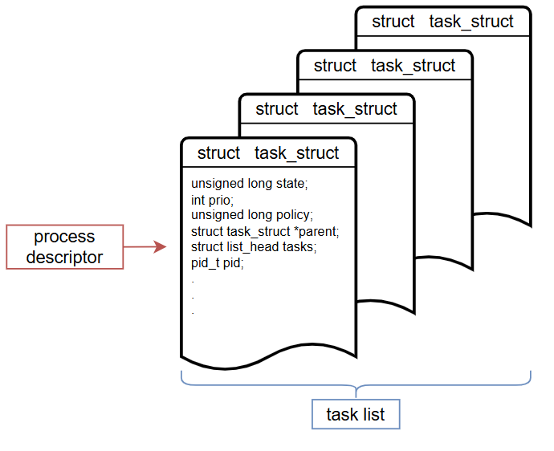

# Linux 內核設計與實現（原書第3版·典藏版） Linux Kernel Development, 3/e 學習筆記

[購買連結](https://www.tenlong.com.tw/products/9787111748793)

</br>

---

</br>

# 作業系統與 Kernel 簡介

作業系統：整個系統中負責完成最基本功能和系統管理的那些部分。

Kernel 有時候會被稱為管理者或是操作系統核心。

先簡單了解有那些 Kernel process：
* 負責響應中斷 → 中斷服務程序
* 管理多個程序與分享 CPU 處理時間的 → 調度程序
* 管理程序地址空間 → 記憶底管理程序

</br>

須注意，一般來說 Kernel Space 獨立於普通的應用程式，它處於系統態，擁有受保護的記憶體空間與訪問硬體設備的所有權。

上述所說的系統態和被保護起來的記憶體空間稱為：Kernel Space；相對的，應用程序所在的位置則是在使用者空間：User Space。

那想當然使用者空間只能使用與看到部分系統資源，並且使用特定系統功能。

</br>

執行時的區別
* Kernel 執行時，系統以核心態（Kernel Mode）進入 Kernel Space 執行。
* 普通應用程式執行時，系統將以使用者態（User Mode）進入使用者空間。

</br>

# Process Management

### 簡介

先簡單區分一些名詞避免之後搞亂：
* Program : 程式
  * 程式碼的集合
  * 還沒有被執行，因此也就還沒有被載入至記憶體中，而是存放在次級儲存裝置中。

* Process : 進程
  * 被執行且載入記憶體的 program
  * 以 Linux Kernel 的角度去說明時，有時候會稱為 task 也就是任務

* Thread : 執行緒（線程）
  * 存在於 process 裡面
  * 一個進程裡至少會有一個線程
  * 作業系統能夠進行運算排程的最小單位

</br>

## 進程

進程 Process 也就是長期處於執行期間的程序。

實際上，進程就是正在執行的程式碼的實時結果，Kernel 需要有效又透明的管理所有細節。

</br>

執行緒，簡稱線程（Thread），每個線程都擁有一個獨立的程序計數器、Process 堆疊和一組 Process 暫存器。

作業系統實際在運作在再調用的並不是 Process 而是 Thread，也就是說實際執行任務的並不是進程，而是進程中的線程，一個進程有可能有多個線程，其中多個線程可以共用進程的系統資源。

</br>

## 進程描述符與任務結構

Kernel 會把進程的列表存放在任務隊列（Task list）的雙向循環鏈表中。

鏈表中的每一項類型都是 task_struct，稱為進程描述符（process descriptor）的結構。

進程描述符中包含的資料能完整的描述一個正在執行的程序：它打開的文件、進程的地址空間、掛起的信號、進程的狀態 ... 等。

</br>



</br>

上圖則是一個範例圖，其中進程描述符則代表的是該進程的所有狀態，如上述所描述，這裡可以先想像成：我們之前所學的 FreeRTOS 中一個任務本身會有不同的狀態，像是掛起、就緒之類的，那進程描述符就是要告訴我的 Kernel 這個進程他目前的狀態是甚麼。

</br>

### 分配進程描述符

Linux 通過 slab 分配器分配 task_struct 結構，以達到對象複用與緩存著色。

甚麼是 slab：一組包含一個或多個連續頁面的記憶體，這些頁面包含特定大小的核心物件。

slab 分配器：Linux 核心中的記憶體配置會比使用者模式中略為單純，因為 meta-data 通常不與資料主體存在放同一個空間 (例如使用者模式的 heap)，而是儲存在不同的結構中。

每個 CPU 都有一個有效的 slab 用於每種類型的物件。這意味著，當在某個 CPU 上配置某種類型/大小的物件時，僅從該 CPU 的有效 slab 中配置空間，直到沒有更多的空閒空間。當沒有更多空間時，另一個 slab 將被標記為該 CPU 的有效 slab。需要注意的是，不同的處理器有不同的有效的 slab。

在 SLUB 配置器中，kmem_cache 結構體負責分類管理。說到分類，我們總是按照某些屬性進行分類，對應到真實世界，就是說賣場中各項商品的用途。

</br>

使用 slab 分配器動態生成 task_struct（就是上述所提到的：進程描述符結構），所以只需要在堆疊底下或是上方創建一個新的結構 struct thread_info。

```c
struct thread_info
{
    struct task_struct      *task;
    struct exec_domain      *exec_domain;
    __u32                   flags;
    __u32                   status;
    __u32                   cpu;
    int                     preempt_count;
    mm_segment_t            addr_limit;
    struct restart_block    restart_block;
    void                    *sysenter_block;
    int                     uaccess_err;
};
```

</br>

每個任務的 thread_info 結構在他的 Kernel 堆疊尾端分配，結構中 task 域中存放的是指向該任務實際 task_struct 的指針。

</br>

### 進程描述符的存放

Kernel 通過一個唯一的進程標示值（process identification value）或 PID 標示每個進程。

PID 本身就是一個數（int），表示為 pid_t 隱含類型（數據的物理表示是未知的或不相關的），既然知道是 int 那默認的最大值當然是 32768，這個值就是實際上系統允許同時存在的進程最大數目。

在 Kernel 中，訪問任務通常需要獲得指向其 task_struct 的指標。實際上，Kernel 中大部分處理進程的代碼都是直接通過 task_struct 進行的。

若是要查找當前正在執行的進程的進程描述符，可以使用 current 宏查詢。

</br>

### 進程狀態

進程描述符中的 state 域描述了進程當前的狀態。

系統中每個進程都必然處於以下五種狀態的其中一種：
