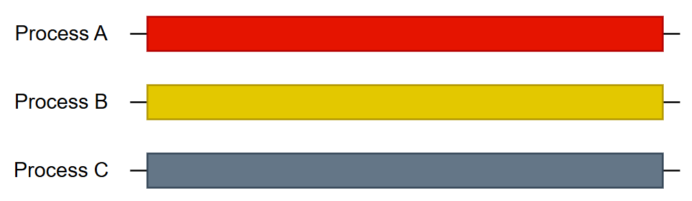

# OS Kernel Develop

#### 介紹

主旨為開發 Operating System（OS、作業系統）

目前針對對象：Linux Kernel
使用的相關工具：Yocto project

## 並行計算

在開始之前先介紹基本觀念：並行計算。 
這是作業系統中一定要先理解的觀念。 

先前已經有學過的韌體知識可以先丟掉，接下來會是不一樣的觀念。 

### 交錯執行、平行、並行

在不同的系統中執行流程會有不同的執行方式，也是我們常講的執行緒，在以前的觀念中我們所繪製的流程圖都是單執行緒（單核心、單CPU）。 

但後續我們開始了 RTOS，也就是所謂的類多執行緒，在類多執行緒中，我們會把一個單執行緒（單核心、單CPU）的系統所需要處理的事，切分成多個任務，在這樣的情況下我們做的事其實只是將程序切分成多個任務去執行而已，並不是所謂的並行或平行執行。注意，就算切成多任務也會設立明確的切割點。 

平行執行（Parallel），所謂的平行執行是多個程序在同一時間同時執行，最常見的情況就是在多核心晶片中，在開發這樣的系統架構時，最簡單的做法就是在不同的 CPU 中分別寫不同的程式並直接讓晶片執行，在不考慮其他的情況下（如對稱架構、非對稱架構），通常都可以直接讓 CPU 分開執行程序。 
用專業術語來說的話，平⾏執⾏程式的 process 或 thread 數⽬和 CPU 或核⼼
⼀樣多，每⼀個 process 或 thread 都佔⽤⼀個 CPU 或核心，使得所有 process 或 thread 都能同時執⾏。 

並行執行（Concurrent），並行執行的情況則較為特殊，通常他的程序會遠大於 CPU 和核心，這樣的情況下這些程序是在交錯或是平行之間執行。一開始這樣說可能很抽象，拿我們常用的作業系統舉例的話，當我們開啟很多視窗時屬於平行執行，因為 CPU 本身會一直執行我們所賦予的工作並不會隨意 Kill 掉任何程序，頂多給予的資源較少。 
再多一層想像，我們現在正在操作一個四核心的 CPU，此時開啟四個程式，其中一個包含記事本（具有輸入與輸出的功能），現在我們開始操作記事本，在操作記事本的同時由於四核心的架構無法負荷超過四個程序（需要輸入輸出，加上原本的四項程式，所以為六項），在這個記事本中我們一邊輸入可以一邊看到我們所輸入的文字同時顯示（交錯），此時系統會讓某些程序執行很短的時間後把核心交給其他程序使用，於是任意時刻，每一個程序在執行上都會有進展，在執行完成之前都會是做一下、停一下、再繼續做一下。 

 

### 1. 交錯執行
     
### 2. 平行執行
     
### 3. 並行執行  
   Process 是在交錯執⾏或平⾏執⾏  

 

## 同步（Synchronization）

在知道這些執行方式之後，有一個明顯的問題將會浮顯出來，也就是這些程序之間會需要互相溝通。舉個例子，今天專題小組分工，分成硬、韌、軟體，但若是組員之間沒有良好的溝通，那這個小組的運作一定有問題，甚至可能會無法完成原本預計的工作，由上述可見溝通的重要性。 

 

---

 

## 作業系統和硬體基本知識

### 多處理機系統、對稱多處理機系統、多核心系統 

### 雙執行模式

### Interrupt & Trap

